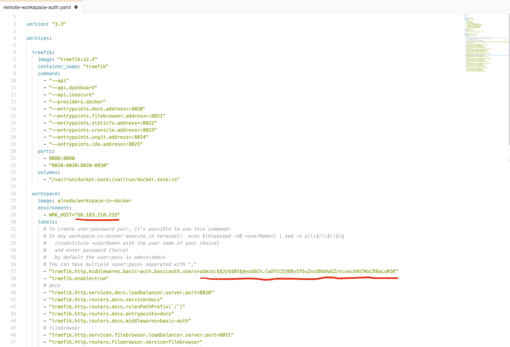

## Workspace in cloud with auth

When running workspace-in-docker on the remote server, it is useful to add authentication mechanism, otherwise anyone in the world 
who gets to know the IP of the remote server will be able to use your workspace.  

Workspace includes several tools, some of them have their own auth features. We turn them off because wit is tedious to configure 
auth for every separate tool. You probably would want one auth mechanism applied to all tools in the workspace. To make this possible 
we put the whole workspace behind the reverse proxy and use [Traefik basic auth](https://doc.traefik.io/traefik/middlewares/basicauth/)

Here is [the docker-compose file](../docker-compose/remote-workspace-auth.yaml) that will let you add auth to your workspace.  

**In order to launch workspace with authentication, you'll need to do the following 3 steps:**

#### 1. Get any cloud server, and install docker on it 
There are even cloud virtual servers that already coming with docker installed, for example 
DigitalOcean docker droplets from the Marketplace.  

#### 2. Copy [docker compose file](../docker-compose/remote-workspace-auth.yaml) and update 2 configurations for the service called 'workspace'
The places you need to change are marked on this picture: 



- environmental variable `WRK_HOST` - set it to be the public IP of the server you've got
- update authentication. The default user/pass is admin/admin, you might want to change it to your own user/pass. 

The password for the traefik basic auth must be encrypted with the **htpasswd**. For connvenience, 
it is installed in every workspace-in-docker, and the easiest way is to generate the password 
is to launch workspace locally first, use its terminal to create a password, and then start 
workspace on remote server.  

To encrypt password open terminal of the local workspace and execute 

> ```echo $(htpasswd -nB <userName>) | sed -e s/\\$/\\$\\$/g```  

substitute `<userName>` with the new user name, and prowide password on prompt. After this htpasswd will output encrypted password.

Don't forget to change this line in the docker-compose file with the new user:encpypted_pass

```
- "traefik.http.middlewares.basic-auth.basicauth.users=admin:$$2y$$05$$eub6CV.CwUYCCQjNBvSf5uZnzdRmVwGZ/ncxecb9O7WxCR8aLuM3K"
```


ssh to the remote server and create file `remote-workspace-auth.yaml`. For example `nano remote-workspace-auth.yaml`, paste the content of the 
modified file and save changes. 

#### 3. Start workspace with docker-compose 

```
docker-compose -f remote-workspace-auth.yaml up -d
```

***Open in browser `<IP-of-new-server>:8020`*** and use user/path to access the workspace UI. All the tools in the workspace will be 
protected by the same authentication as well.  

Workspace will be running as daemon. You can exit ssh terminal, and close the connection with the remote server. 
The workspace will keep unning and will be accessible via the Internet for anyone who knows user and password.  

> You can now use the remote workspace to collaborate with your friends and colleagues. Let them know the URL of the workspace UI and user/pass.

## Stop workspace

In order to stop workspace ssh to the remote server, go to the folder where you saved the file `remote-workspace-auth.yaml` and execute 

```
docker-compose -f remote-workspace-auth.yaml down
```

